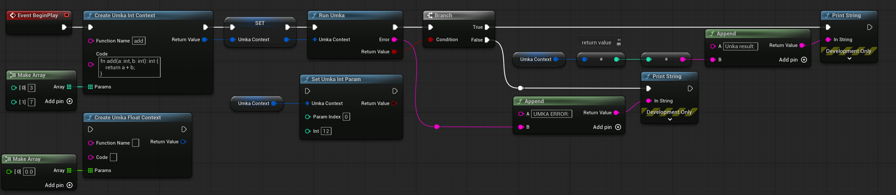

# UEmka

**UEmka** is an Unreal Engine plugin that embeds the [Umka](https://github.com/vtereshkov/umka-lang) scripting language directly into Blueprint nodes.



### What is Umka

[Umka](https://github.com/vtereshkov/umka-lang) is a statically typed embeddable scripting language. It combines simplicity and flexibility with compile-time type checking, following the principle _Explicit is better than implicit_.

[The Umka Language Reference](https://github.com/vtereshkov/umka-lang/blob/master/doc/lang.md)


## Installation

Get `UEmka.zip` from the [releases](https://github.com/Solessfir/UEmka/releases) and extract it into your project's `Plugins` folder.


## Usage

Search for **Umka Script** in the Blueprint node palette and place it in any event graph.

The node contains an inline code editor. Write an exported Umka function and the node will automatically generate typed input and output pins matching its signature.


## Writing Scripts

### The export marker `*`

`*` is Umka's export marker - it makes an identifier visible outside the module, similar to Go's uppercase convention. The node calls your function via the Umka embedding API, which can only find **exported** functions. A function without `*` is private to the script.

```
fn helper(x: int): int {  // private - usable inside the script only
    return x * 2
}

fn run*(x: int): int {    // exported - the node calls this
    return helper(x)
}
```

**Rules:**
- The function the node calls **must** have `*`
- Internal helper functions do **not** need `*`
- `main` is reserved as the zero-parameter program entry point - never name your exported function `main`

### Supported types

| Umka type | Blueprint pin |
|-----------|--------------|
| `int`     | Integer64    |
| `int8` `int16` `int32` | Integer |
| `uint8` `char` | Byte    |
| `uint16` `uint32` | Integer |
| `uint`    | Integer64    |
| `bool`    | Boolean      |
| `real`    | Double       |
| `real32`  | Float        |
| `str`     | String       |
| user-defined `enum` type | Byte |

A function with no return type produces no output pin.

Any unknown identifier in the signature is treated as a user-defined enum type and maps to a `Byte` pin. The pin label shows the enum name so you know which type to pass:

```
type Direction = enum { North; East; South; West }

fn opposite*(d: Direction): Direction {
    return Direction((int(d) + 2) % 4)
}
```

This generates a `Byte` input pin labeled `d (Direction)` and a `Byte` output pin labeled `Direction`.

The `type` definition must be present in the script - Umka requires it to compile. The named constants (`North`, `East`, etc.) are available anywhere in the script body.

Enum arrays work as well: `[]Direction` maps to an Array of Byte pin. Enums with an explicit base type (`type Tiny = enum (uint8) { ... }`) are supported too.

### Multiple return values

Wrap the return types in parentheses to get one output pin per value:

```
fn minmax*(a: int, b: int): (int, int) {
    if a < b {
        return a, b
    }
    return b, a
}
```

This generates two `Integer64` output pins. Pins are named `ReturnValue1`, `ReturnValue2`, etc.

| Umka syntax | Output pins |
|-------------|-------------|
| `fn foo*(): (int, str)` | `ReturnValue1`: Integer64, `ReturnValue2`: String |
| `fn foo*(): (real32, bool)` | `ReturnValue1`: Float, `ReturnValue2`: Boolean |

Array types are also supported in multi-return:

```
fn splitEven*(nums: []int): ([]int, []int) {
    evens := make([]int, 0)
    odds  := make([]int, 0)
    for _, v in nums {
        if v % 2 == 0 {
            evens = append(evens, v)
        } else {
            odds = append(odds, v)
        }
    }
    return evens, odds
}
```

This generates `ReturnValue1`: Array of Integer64 and `ReturnValue2`: Array of Integer64.

A single-element list like `(int)` is treated the same as a plain `int` return.

### Arrays

Prefix any type with `[]` to get an array pin. Both dynamic (`[]type`) and static (`[N]type`) array syntax are accepted - both produce a Blueprint array pin of the corresponding element type.

```
fn double*(nums: []int): []int {
    res := make([]int, len(nums))
    for i, v in nums {
        res[i] = v * 2
    }
    return res
}
```

| Umka array type | Blueprint array pin |
|-----------------|---------------------|
| `[]int`         | Array of Integer64  |
| `[]int8` `[]int16` `[]int32` | Array of Integer |
| `[]uint8` `[]char` | Array of Byte   |
| `[]uint16` `[]uint32` | Array of Integer |
| `[]uint`        | Array of Integer64  |
| `[]bool`        | Array of Boolean    |
| `[]real`        | Array of Double     |
| `[]real32`      | Array of Float      |
| `[]str`         | Array of String     |
| `[]MyEnum` (user-defined enum) | Array of Byte |

### Structs

Structs declared in the script can be used in the exported function's signature. The node flattens them into one pin per field:

```
type Vec2 = struct { x, y: real }

fn move*(p: Vec2, d: Vec2, scale: real): Vec2 {
    return Vec2{x: p.x + d.x*scale, y: p.y + d.y*scale}
}
```

This generates input pins `p.x`, `p.y`, `d.x`, `d.y` (Double), `scale` (Double), and two output pins `x`, `y` (Double) - one per field of the returned struct.

Under the hood the node compiles a small wrapper function with a flat signature that packs the pins into struct values, calls your function, and unpacks the result. Your script is unchanged.

**Constraints:**
- Field types must be scalars: numbers, `bool`, `char`, `str`, or enums. Structs containing arrays, maps, nested structs, pointers, or function types cannot cross the pin boundary (they still work freely inside the script)
- Struct arrays (`[]Vec2`) cannot be passed as pins
- Structs inside a multi-return tuple (`fn f*(): (Vec2, int)`) are not supported - return the struct alone instead
- The identifier `__uemka_call` is reserved for the generated wrapper

### Example - Fibonacci

Computes the N-th Fibonacci number:

```
fn fib*(n: int): int {
    if n <= 1 {
        return n
    }
    a := 0
    b := 1
    for i := 2; i <= n; i++ {
        t := a + b
        a = b
        b = t
    }
    return b
}
```

This generates one `Integer64` input pin (`n`) and one `Integer64` output pin.


## Debugging

`printf` output from your script is captured and forwarded to the Unreal Output Log under the `LogUEmka` category, prefixed with the function name:

```
fn foo*(x: int): int {
    printf("input: %d\n", x)
    return x * 2
}
```

```
LogUEmka: [foo] input: 42
```

Captured output is limited to 64 KB per execution - anything beyond that is dropped and a truncation warning is logged.


## Error Handling

**Compile-time:** The node validates your script every time you compile the Blueprint. Errors are reported in the compiler results panel and the error line is highlighted red in the editor.

**Runtime:** If the script fails during execution, the error is logged to the Output Log under the `LogUEmka` category, including the calling Blueprint path and function name.


## Limitations

The following Umka features are not currently supported as Blueprint pins:

- **Structs with complex fields** - structs containing arrays, maps, nested structs, pointers, or function types (scalar-field structs are flattened into pins, see [Structs](#structs))
- **Struct arrays** - `[]Vec2` cannot be passed as pins
- **Structs in multi-return tuples** - `fn f*(): (Vec2, int)` is not supported
- **Maps** - `map[K]V` types are not supported
- **Closures / function types** - `fn(int): int` cannot be passed as a pin
- **Pointers** - `^type` and `weak ^type` are not supported
- **Pointers inside multi-return** - `fn foo*(): (^int, str)` is not supported

All of the above can still be used freely **inside** your script as local variables, helper types, and intermediate values - the restriction applies only to the exported function's signature (its parameters and return type).

```
type Vec2 = struct { x, y: real }   // struct as a local type - fine

fn length*(x: real, y: real): real {
    v := Vec2{x, y}                 // struct as a local variable - fine
    return math.sqrt(v.x*v.x + v.y*v.y)
}
```
