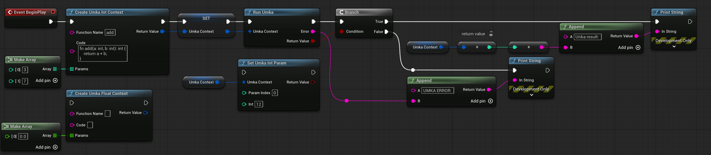

# UEmka

**UEmka** is an Unreal Engine plugin that embeds the [Umka](https://github.com/vtereshkov/umka-lang) scripting language directly into Blueprint nodes.

Bundled interpreter: [Umka 1.5.7](https://github.com/vtereshkov/umka-lang/releases/tag/v1.5.7). See [vendoring details](Source/UmkaLib/README.md) for the pinned source revision and integration patches.



### What is Umka

[Umka](https://github.com/vtereshkov/umka-lang) is a statically typed embeddable scripting language. It combines simplicity and flexibility with compile-time type checking, following the principle _Explicit is better than implicit_.

[The Umka Language Reference](https://github.com/vtereshkov/umka-lang/blob/v1.5.7/doc/lang.md)


## Installation

Get `UEmka.zip` from the [releases](https://github.com/Solessfir/UEmka/releases) and extract it into your project's `Plugins` folder.


## Usage

Search for **Umka Script** in the Blueprint node palette and place it in any event graph.

The node contains an inline code editor. Write an exported Umka function and the node will automatically generate typed input and output pins matching its signature.

The function selector chooses any exported function in the script. **Automatic (first export)** preserves the original behavior. A missing, private, or differently capitalized selection produces a compile error. Select the node to configure its script asset and native struct pins in the Details panel.


## Writing Scripts

### The export marker `*`

`*` is Umka's export marker - it makes an identifier visible outside the module, similar to Go's uppercase convention. The node calls your function via the Umka embedding API, which can only find **exported** functions. A function without `*` is private to the script.

```
fn helper(x: int): int {  // private - usable inside the script only
    return x * 2
}

fn run*(x: int): int {    // exported - the node calls this
    return helper(x)
}
```

**Rules:**
- The function the node calls **must** have `*`
- Internal helper functions do **not** need `*`
- `main` is reserved as the zero-parameter program entry point - never name your exported function `main`

### Supported types

| Umka type | Blueprint pin |
|-----------|--------------|
| `int`     | Integer64    |
| `int8` `int16` `int32` | Integer |
| `uint8` `char` | Byte    |
| `uint16` | Integer |
| `uint32` | Integer64 |
| `uint`    | Integer64    |
| `bool`    | Boolean      |
| `real`    | Double       |
| `real32`  | Float        |
| `str`     | String       |
| user-defined `enum` type | Pin for its integer base (Integer64 by default) |

A function with no return type produces no output pin.

Enum pins preserve the signedness and range of their declared integer base. The pin label shows the enum name:

```
type Direction = enum { North; East; South; West }

fn opposite*(d: Direction): Direction {
    return Direction((int(d) + 2) % 4)
}
```

This generates an `Integer64` input pin labeled `d (Direction)` and an `Integer64` output pin labeled `Direction`.

The `type` definition must be present in the script - Umka requires it to compile. The named constants (`North`, `East`, etc.) are available anywhere in the script body.

Enums at the pin boundary, including struct fields, require a named type declaration.

Enum arrays use the same base mapping: `[]Direction` maps to an Array of Integer64 pin. An explicit base such as `enum (uint8)` uses Byte pins, while `enum (int8)` uses Integer pins and preserves negative values.

Integer inputs outside the compiled Umka type's range fail with a runtime error instead of truncating. `uint32` uses Integer64 to represent `0..4294967295`. Since Blueprint has no unsigned 64-bit pin, `uint` preserves all 64 bits in Integer64: negative pin values represent the unsigned upper half.

Valid scripts resolve type aliases through the Umka compiler. Aliases of supported scalars, enums, arrays, structs, and maps use the same pins as their underlying types. Unknown types and aliases of unsupported shapes produce compile errors. During incomplete edits, a source-based preview remains available for explicitly declared supported types.

Raw strings enclosed in backticks can span lines. Their contents, including quotes, comment markers, and backslashes, remain literal and do not affect function discovery or syntax highlighting.

Existing Blueprint connections to enum or `uint32` pins may need reconnecting after their pin types change. Recompile affected Blueprints after updating the plugin.

### Multiple return values

Wrap the return types in parentheses to get one output pin per value:

```
fn minmax*(a: int, b: int): (int, int) {
    if a < b {
        return a, b
    }
    return b, a
}
```

This generates two `Integer64` output pins. Pins are named `ReturnValue1`, `ReturnValue2`, etc.

| Umka syntax | Output pins |
|-------------|-------------|
| `fn foo*(): (int, str)` | `ReturnValue1`: Integer64, `ReturnValue2`: String |
| `fn foo*(): (real32, bool)` | `ReturnValue1`: Float, `ReturnValue2`: Boolean |

Array types are also supported in multi-return:

```
fn splitEven*(nums: []int): ([]int, []int) {
    evens := make([]int, 0)
    odds  := make([]int, 0)
    for _, v in nums {
        if v % 2 == 0 {
            evens = append(evens, v)
        } else {
            odds = append(odds, v)
        }
    }
    return evens, odds
}
```

This generates `ReturnValue1`: Array of Integer64 and `ReturnValue2`: Array of Integer64.

A single-element list like `(int)` is treated the same as a plain `int` return. Structs in a return tuple are recursively flattened into fields in declaration order by default; arrays and maps remain single output pins.

### Default parameters

Unconnected inputs use the defaults evaluated by the Umka compiler, including constant expressions, enums, strings, arrays, and supported structs. Scalar defaults appear directly on the pins. Defaults for struct parameters apply to their flattened fields or native struct pin. Connecting an input or editing its default overrides the script default.

### Arrays

Prefix any supported scalar or struct type with `[]` or `[N]` to get an array pin. Dynamic (`[]type`) and fixed-size (`[N]type`) arrays both appear as Blueprint arrays, but retain their native Umka ABI. A fixed-size input must contain exactly `N` elements; otherwise execution fails with an error reporting the required and supplied lengths. Constant expressions in `[N]` are supported because the final length is read from the compiled Umka type.

```
fn double*(nums: []int): []int {
    res := make([]int, len(nums))
    for i, v in nums {
        res[i] = v * 2
    }
    return res
}
```

| Umka array type | Blueprint array pin |
|-----------------|---------------------|
| `[]int`         | Array of Integer64  |
| `[]int8` `[]int16` `[]int32` | Array of Integer |
| `[]uint8` `[]char` | Array of Byte   |
| `[]uint16` | Array of Integer |
| `[]uint32` | Array of Integer64 |
| `[]uint`        | Array of Integer64  |
| `[]bool`        | Array of Boolean    |
| `[]real`        | Array of Double     |
| `[]real32`      | Array of Float      |
| `[]str`         | Array of String     |
| `[]MyEnum` (user-defined enum) | Array for its integer base |
| `[]MyStruct` | Array of generated Blueprint structs |

The same pin mapping applies to fixed-size forms such as `[4]int` and `[Count]real`. Fixed-size return values are copied from Umka's inline array storage back into the Blueprint array.

### Structs

Structs declared in the script can be used in the exported function's signature. The node flattens them into one pin per field:

```
type Vec2 = struct { x, y: real }

fn move*(p: Vec2, d: Vec2, scale: real): Vec2 {
    return Vec2{x: p.x + d.x*scale, y: p.y + d.y*scale}
}
```

This generates input pins `p.x`, `p.y`, `d.x`, `d.y` (Double), `scale` (Double), and two output pins `x`, `y` (Double) - one per field of the returned struct.

Under the hood the node compiles a small wrapper function with a flat signature that packs the pins into struct values, calls your function, and unpacks the result. Your script is unchanged.

Fields may contain supported scalars, arrays, maps, and nested structs. Nested struct fields are recursively flattened, so a field such as `p.position.x` becomes a scalar pin while `p.samples` remains an array pin.

Struct arrays use native Blueprint struct arrays. Their element types are generated from the compiled field layout and saved with the owning Blueprint package. Fields in these native structs can include nested structs, arrays, and maps. Identical field layouts share a generated type within the package.

Enable **Native Struct Pins** in the node's Details panel to pass individual structs through one native Blueprint pin. Standard Make/Break and split-pin workflows are available. Structs in return tuples then occupy one output pin each. Existing nodes retain flattened pins by default. Compiler defaults populate native input pins, including nested fields, and edited defaults override them.

**Constraints:**
- Native Blueprint struct field names must be unique without regard to case
- Flattened input pin names must be unique without regard to case
- The input name `execute` is reserved for Blueprint execution
- A generated wrapper supports up to 15 flattened inputs, or 14 when returning arrays, maps, or multiple values
- The identifier `__uemka_call` is reserved for the generated wrapper

### Maps

`map[K]V` becomes a native Blueprint Map pin. Keys can be any supported integer type, a named enum, or `str`; values can be any supported scalar, named enum, or supported struct. Integer ranges follow the same rules as scalar pins.

```
fn increment*(counts: map[str]int): map[str]int {
    counts["calls"]++
    return counts
}
```

Maps are also supported in struct fields and return tuples. Struct values use generated native Blueprint structs and may contain nested structs, arrays, and supported maps. Direct container values and floating-point keys cannot cross Blueprint pins.

Blueprint string keys compare without regard to case. An Umka map containing keys that differ only by case cannot be converted and reports a duplicate-key error.

### Reusable scripts and modules

Create a **UEmka Script Asset** in the Content Browser and edit its **Source** in the asset's Details panel. Assign it to a node's **Script Asset** property to reuse the same script in multiple graphs. The node displays the asset's source read-only and provides a link to open the asset. Clearing the asset restores the node's inline script.

Each asset has a **Module Path** and an **Imports** list. An empty path uses the asset name plus `.um`. Explicit paths must be relative `.um` filenames with forward slashes, no empty or `.`/`..` segments, and at most 255 UTF-8 bytes. Paths identify sources within the shared virtual module root; import strings resolve relative to the importing module.

For example, give a helper asset the path `lib/helpers.um` and source:

```
fn twice*(value: int): int { return value * 2 }
```

Give the main asset the path `main.um`, add the helper asset to its **Imports**, and use:

```
import helpers = "lib/helpers.um"

fn calculate*(value: int = 7): int {
    return helpers::twice(value)
}
```

Imports may reference assets that import further assets. Missing references, cycles, and conflicting module paths produce errors. Imported types used by generated wrappers must be accessible through the main module's import aliases. Changing a referenced asset refreshes loaded nodes and marks their Blueprints for recompilation.

The compiled Blueprint keeps a hard reference to its source asset, and assets retain their transitive imports. Source text and module dependencies remain available in cooked builds. Asset-backed scripts load imports from these assets and Umka's embedded standard modules; they do not fall back to loose source files on disk.

### Example - Fibonacci

Computes the N-th Fibonacci number:

```
fn fib*(n: int): int {
    if n <= 1 {
        return n
    }
    a := 0
    b := 1
    for i := 2; i <= n; i++ {
        t := a + b
        a = b
        b = t
    }
    return b
}
```

This generates one `Integer64` input pin (`n`) and one `Integer64` output pin.


## Debugging

`printf` output from your script is captured and forwarded to the Unreal Output Log under the `LogUEmka` category, prefixed with the function name:

```
fn foo*(x: int): int {
    printf("input: %d\n", x)
    return x * 2
}
```

```
LogUEmka: [foo] input: 42
```

Captured output is limited to at most 64 KB per execution; the operating system's pipe capacity can lower this limit. Excess output is dropped and a truncation warning is logged. Concurrent script calls serialize stdout capture so their output keeps the correct function prefix.


## Error Handling

**Compile-time:** The node validates your script every time you compile the Blueprint. Errors are reported in the compiler results panel and the error line is highlighted red in the editor.

**Runtime:** If initialization, parameter validation, or script execution fails, the error is logged to the Output Log under the `LogUEmka` category, including the calling Blueprint path and function name. Failed executions clear their outputs so values from an earlier call cannot be reused.


## Limitations

The following Umka features are not currently supported as Blueprint pins:

- **Directly nested containers** - `[][]int`, arrays of maps, and maps with container values; a struct may contain supported arrays and maps
- **Unsupported map keys** - floating-point, struct, and container keys
- **Structs with unsupported fields** - pointers, interfaces, or function types
- **Closures / function types** - `fn(int): int` cannot be passed as a pin
- **Pointers** - `^type` and `weak ^type` are not supported
- **Pointers inside multi-return** - `fn foo*(): (^int, str)` is not supported
- **Interfaces** - `any` and other interface types cannot be passed as pins
- **Aliases of unsupported types** - resolving an alias does not make an unsupported shape eligible for pins
- **Unknown or undeclared types** - the Umka compiler must resolve exported signature types

All of the above can still be used freely **inside** your script as local variables, helper types, and intermediate values - the restriction applies only to the exported function's signature (its parameters and return type).

Composite values are limited to 16 nesting levels, 65,536 items per container, 262,144 total values, and 64 MiB of serialized data per value.

```
type Vec2 = struct { x, y: real }   // struct as a local type - fine

fn length*(x: real, y: real): real {
    v := Vec2{x, y}                 // struct as a local variable - fine
    return math.sqrt(v.x*v.x + v.y*v.y)
}
```

## Tests

Run the `UEmka` group in Unreal Editor's Automation window, or launch the editor with `-unattended -nullrhi -nosound -ExecCmds="Automation RunTests UEmka;Quit"`.

The suite covers every supported scalar type and enum integer base, aliases, dynamic and fixed arrays, empty containers, integer boundaries, Unicode strings, compiler-evaluated defaults, nested structs, mixed tuples, native scalar and struct-valued maps, native struct arrays, and optional native individual struct pins. Blueprint tests compile and execute supported mappings through connected input and output pins. Additional tests cover native default editing/splitting, exported function selection, module graphs and imported types, malformed composite data, rejected signatures, runtime failures and output resets, logging and concurrent capture, graph reconstruction, transaction undo/redo, compiled Blueprint and native struct package save/load, embedded editor input, and syntax highlighting.

For cooked validation, run the editor commandlet `-run=UEmkaCookFixture` in a disposable C++ host project, cook its `Content/UEmkaCookValidation` directory, and run its Development game with `-ExecCmds="Automation RunTests UEmka.Cooked.AssetExecution;SoftQuit"`. The commandlet creates fixture assets only when explicitly invoked; normal editor automation tests do not create game content.

These are integration and regression tests for the plugin's supported interfaces, rather than exhaustive tests of the Umka language or a measured line-coverage guarantee. Platform-specific logging behavior still needs validation on each supported platform.

## License

Licensed under the [MIT License](LICENSE).
